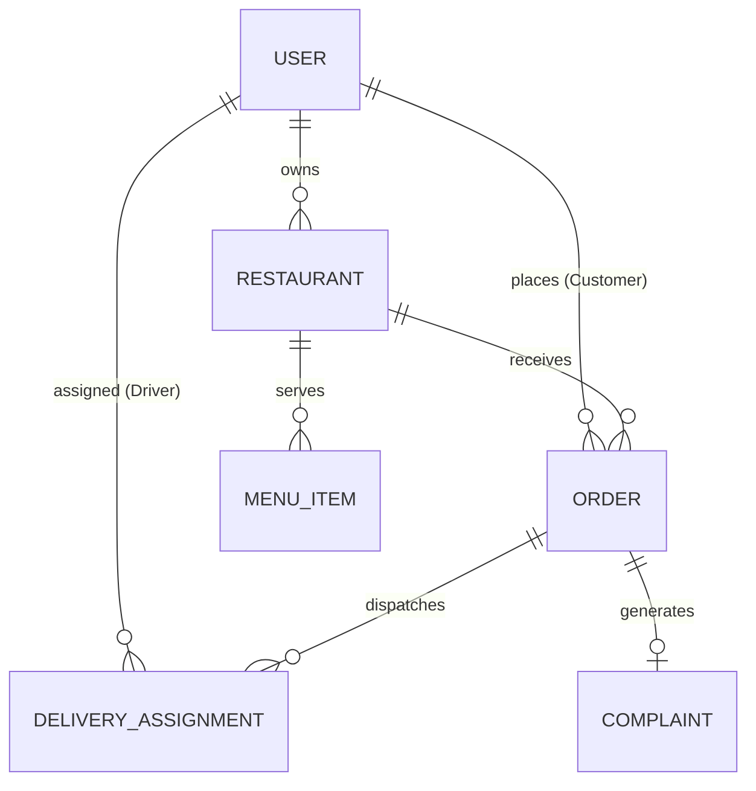

# QuickBite — Food Delivery & Restaurant Operations Platform


> **Official VESA Skill Development Program — Project 2 Implementation**  
> **Live Production Application**: [https://quickbite-platform.vercel.app](https://quickbite-platform.vercel.app)  
> **API Health Check**: [https://quickbite-platform.vercel.app/api/health](https://quickbite-platform.vercel.app/api/health)

---

## 🌟 Executive Overview & Problem Understanding

QuickBite is an enterprise-grade, multi-tenant food delivery and restaurant operations platform engineered using **Node.js, Express, MongoDB, React 18, and Socket.IO**. It addresses key industry pain points by unifying four distinct stakeholders onto a single real-time platform:

- 👤 **Customer**: Search & filter restaurants by cuisine, browse menus, manage cart, place atomic orders, track live multi-step order timelines, rate orders, and file dispute complaints.
- 🏪 **Restaurant Owner**: Monitor incoming orders, manage kitchen prep queues (`PLACED` → `ACCEPTED` → `PREPARING` → `READY_FOR_PICKUP`), toggle store duty (`OPEN`, `PAUSE ORDERS`, `CLOSED`), and manage menu item stock & pricing.
- 🛵 **Delivery Partner**: Online/offline duty controls, automated trip assignment, accept/reject controls with **automated system reassignment**, trip status updaters (`PICKED_UP` → `OUT_FOR_DELIVERY` → `DELIVERED`), and earnings analytics.
- 🛡️ **Platform Administrator**: Monitor platform GMV, approve/revoke restaurant onboarding, inspect live fleet orders with fraud anomaly indicators, suspend abusive accounts, and resolve customer dispute tickets with gesture refunds.

---

## 1-Click Demo Switcher Credentials

The application includes an embedded **Demo Persona Switcher Modal** accessible directly from the top navigation bar, allowing evaluators to switch roles instantly without manual logouts:

| Role Persona | Demo Account | Password | Primary Key Capabilities |
|---|---|---|---|
| 👤 **Customer** | `customer@quickbite.com` | `password123` | Discovery, cart, checkout, live tracking timeline, rating & dispute complaints |
| 🏪 **Restaurant Owner** | `owner@quickbite.com` | `password123` | Kitchen prep queue, store status toggles (`OPEN`/`PAUSED`/`CLOSED`), menu stock |
| 🛵 **Delivery Partner** | `delivery@quickbite.com` | `password123` | Trip assignments, accept/reject, trip status updaters, earnings |
| 🛡️ **Platform Admin** | `admin@quickbite.com` | `password123` | Platform GMV metrics, restaurant approvals, fraud flags, user suspension |

---

## 🏗️ System Architecture & Order Lifecycle State Machine

QuickBite enforces a strict finite state machine for order transitions in [`backend/src/services/orderStateMachine.js`](file:///c:/Users/anann/OneDrive/Desktop/Project/backend/src/services/orderStateMachine.js):

```text
[PLACED] ──> [RESTAURANT_ACCEPTED] ──> [PREPARING] ──> [READY_FOR_PICKUP]
   │                                                         │
   ▼ (Customer Cancel OK)                                    ▼ (Driver Assigned)
[CANCELLED]                                         [DELIVERY_ASSIGNED]
                                                             │
                                                             ▼
                                                    [AT_RESTAURANT]
                                                             │
                                                             ▼
                                                       [PICKED_UP]
                                                             │
                                                             ▼
                                                   [OUT_FOR_DELIVERY]
                                                             │
                                                             ▼
                                                        [DELIVERED]
```

### Real-Time Event Architecture (Socket.IO)
- `order:created` — Sent to restaurant kitchen when a new order is placed.
- `order:status_update` — Broadcast to customer, restaurant owner, and rider.
- `delivery:assigned` / `delivery:reassigned` — Dispatched to online delivery partner.
- `admin:alert` — Broadcast when fraud anomaly threshold or dispute ticket is raised.

---

## 📊 Database Design & Entity Relationships

The MongoDB database comprises 8 schemas documented in [`docs/ER_DIAGRAM.md`](file:///c:/Users/anann/OneDrive/Desktop/Project/docs/ER_DIAGRAM.md):



### Atomic Concurrency Protection
Inventory is reserved atomically during checkout using Mongoose update filters:
```javascript
MenuItem.findOneAndUpdate(
  { _id: item.menuItemId, quantity: { $gte: item.quantity } },
  { $inc: { quantity: -item.quantity } }
)
```
This guarantees zero inventory overselling under high concurrent checkout traffic.

---

## 🔒 Role-Based Access Control (RBAC) & Security

- **Authentication**: Signed JSON Web Tokens (`jsonwebtoken`) with 24-hour expiration.
- **Authorization**: Role-based access control middleware (`rbacMiddleware.js`). Cross-role requests return HTTP 403 Forbidden (e.g. Customer accessing Admin API).
- **Password Hashing**: `bcryptjs` with 10 salt rounds.
- **API Defense**: `helmet` security headers and `express-rate-limit` endpoint protection.

---

## ⚡ Quick Start & Zero-Dependency Execution

The backend includes `mongodb-memory-server` and auto-seeds the demo dataset on launch:

1. **Install Dependencies**:
   ```bash
   npm run install-all
   ```

2. **Start Development Environment**:
   ```bash
   npm run dev
   ```

3. **Run Edge-Case Verification Test Suite**:
   ```bash
   cd backend && node src/utils/runTests.js
   ```

---

## 📁 Repository Directory Structure

```
Project/
├── backend/
│   ├── src/
│   │   ├── config/          # DB connection, JWT, Socket.IO setup
│   │   ├── controllers/     # Auth, Customer, Restaurant, Delivery, Admin, Analytics, Complaint
│   │   ├── middleware/      # Auth, RBAC, RateLimiter, ErrorHandler
│   │   ├── models/          # User, Restaurant, MenuItem, MenuCategory, Order, DeliveryAssignment, Rating, Complaint
│   │   ├── routes/          # REST API endpoints grouped by role
│   │   ├── services/        # OrderStateMachine, InventoryService, DeliveryService, SocketService, SeedData
│   │   └── server.js        # Main Express & Socket.IO server entry
│   └── package.json
├── frontend/
│   ├── src/
│   │   ├── components/      # Navbar, StatusBadge, OrderTimeline, Modals
│   │   ├── context/         # AuthContext, CartContext, SocketContext
│   │   ├── pages/           # Customer, Restaurant, Delivery, Admin pages
│   │   ├── services/        # Axios API client & Socket.IO client
│   │   ├── styles/          # Custom Light Product Design System CSS
│   │   ├── App.jsx          # Protected Routing setup
│   │   └── main.jsx
│   └── package.json
├── docs/                    # Architecture, ER Diagrams, State Machine, API Docs
├── PROJECT_REPORT.md        # Comprehensive VESA Technical Report
└── README.md
```

---

## 📄 Evaluation Report Reference

For full architectural details, database schema specifications, and engineering trade-off analysis, see [`PROJECT_REPORT.md`](file:///c:/Users/anann/OneDrive/Desktop/Project/PROJECT_REPORT.md).
