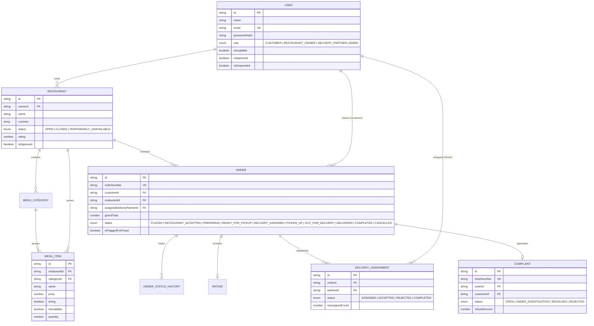

# QuickBite Database Entity-Relationship Diagram

## Mermaid Entity-Relationship Diagram

```mermaid
erDiagram
    USER ||--o{ RESTAURANT : "owns"
    USER ||--o{ ORDER : "places (Customer)"
    USER ||--o{ DELIVERY_ASSIGNMENT : "assigned (Driver)"
    RESTAURANT ||--o{ MENU_CATEGORY : "contains"
    RESTAURANT ||--o{ MENU_ITEM : "serves"
    RESTAURANT ||--o{ ORDER : "receives"
    MENU_CATEGORY ||--o{ MENU_ITEM : "groups"
    ORDER ||--o{ ORDER_STATUS_HISTORY : "tracks"
    ORDER ||--o{ DELIVERY_ASSIGNMENT : "dispatches"
    ORDER ||--o| RATING : "receives"
    ORDER ||--o| COMPLAINT : "generates"

    USER {
        string id PK
        string name
        string email UK
        string passwordHash
        enum role "CUSTOMER | RESTAURANT_OWNER | DELIVERY_PARTNER | ADMIN"
        boolean isAvailable
        boolean isApproved
        boolean isSuspended
    }

    RESTAURANT {
        string id PK
        string ownerId FK
        string name
        array cuisines
        enum status "OPEN | CLOSED | TEMPORARILY_UNAVAILABLE"
        number rating
        boolean isApproved
    }

    MENU_ITEM {
        string id PK
        string restaurantId FK
        string categoryId FK
        string name
        number price
        boolean isVeg
        boolean isAvailable
        number quantity
    }

    ORDER {
        string id PK
        string orderNumber UK
        string customerId FK
        string restaurantId FK
        string assignedDeliveryPartnerId FK
        number grandTotal
        enum status "PLACED | RESTAURANT_ACCEPTED | PREPARING | READY_FOR_PICKUP | DELIVERY_ASSIGNED | PICKED_UP | OUT_FOR_DELIVERY | DELIVERED | COMPLETED | CANCELLED"
        boolean isFlaggedForFraud
    }

    DELIVERY_ASSIGNMENT {
        string id PK
        string orderId FK
        string partnerId FK
        enum status "ASSIGNED | ACCEPTED | REJECTED | COMPLETED"
        number reassignedCount
    }

    COMPLAINT {
        string id PK
        string ticketNumber UK
        string orderId FK
        string customerId FK
        enum status "OPEN | UNDER_INVESTIGATION | RESOLVED | REJECTED"
        number refundAmount
    }
```
